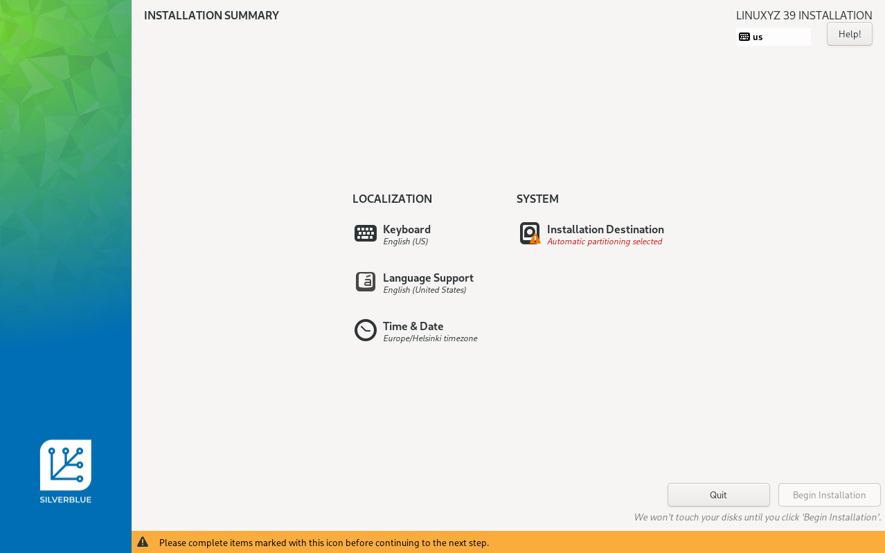

_BlueBuild's ISO command uses [JasonN3's build-container-installer](https://github.com/JasonN3/build-container-installer/) under the hood. Feel free to read it's documentation for more information and usecases. File issues with the `bluebuild` command in the [CLI repository](https://github.com/blue-build/cli) first; they can be re-filed upstream if deemed to not be caused by us._

First you need to choose whether to generate the ISO from remote image or a recipe.

-   Generate from remote image if...
    -   You're trying to install a custom image made by someone else
    -   You are actively building and publishing images (this is the default)
-   Generate from a recipe if...
    -   You don't want to rely on a cloud to build your images for you and are willing to manually run builds locally (or set up some system to automate that for you)

1.  Generate the ISO:

    ```bash
    # Generate ISO from a built and published remote image
    sudo bluebuild generate-iso --iso-name weird-os.iso image ghcr.io/octocat/weird-os

    # Build image and generate ISO from a local recipe
    sudo bluebuild generate-iso --iso-name weird-os.iso recipe recipes/recipe.yml
    ```

2.  Flash the ISO onto a USB drive ([Fedora Media Writer](https://www.fedoraproject.org/en/workstation/download) is recommended) and boot it.

        - The ISO file should be inside your working directory (wherever you ran the command).

        - Once booted, you should be presented with a screen similar to this:

            

        - Lastly, just complete all the outlined install configuration steps, and follow the instructions of the installer
